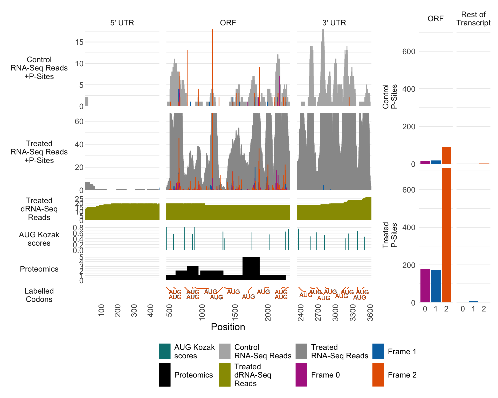

# inspectorORF

**Simplify the analysis and visualization of translated open reading frames (ORFs) using Ribo-Seq data.**


Detecting translated ORFs within Ribo-Seq data often requires evaluating typical features of translation, such as **triplet periodicity** within P-site alignments. `inspectorORF` simplifies the task of visualising and evaluating ORFs with a flexible plotting API and extensive annotation support.

---

## Key Features

- Plot ORFs with RNA-Seq coverage and Ribo-Seq P-sites.
- Compare the same ORFs across multiple conditions or replicates.
- Add custom layers such as:
  - Mass-spec fragment hits
  - Kozak scores
  - Translation efficiency (TE)
- Visualise 5'/3' UTRs and annotate non-canonical start codons.
- Extract nucleotide and amino acid sequences from ORFs with ease.

---

##  Installation

Install Bioconductor dependencies -

```{r}
if (!requireNamespace("BiocManager", quietly = TRUE))
    install.packages("BiocManager")

BiocManager::install(c("plyranges", "bioseq", "Biostrings", "GenomicRanges", "rtracklayer")
```

Install inspectorORF from GitHub:

```r
# install.packages("devtools")
devtools::install_github("aylz83/inspectorORF")
```

##  Dependencies

 - S4Vectors
 - stringr,
 - tibble,
 - tidyr,
 - bioseq
 - plyranges
 - Biostrings
 - data.table
 - GenomicRanges
 - ggh4x
 - ggplot2
 - ggrepel
 - grid
 - patchwork
 - rtracklayer 
 - parallel
 - dplyr
 - methods

## Optional dependencies for interactive plots

 - plotly

## Optional dependencies for the shiny interface

 - shiny
 - reactable
 - shinyFiles
 - shinycssloaders
 - shinydashboard

## Example Data

- Ribo-Seq and RNA-Seq data was processed from GEO accession [GSE16214](https://www.ncbi.nlm.nih.gov/geo/query/acc.cgi?acc=GSE16214), aligned to Gencode V44 and subset for the NTN4 gene.
- Kozak scores calculated with ORFik.
- Proteomic and long-read data simulated for vignette example.

## Quick Start

```r
library(inspectorORF)

# Generate primary track data
tracks <- merge_RNA_tracks_with_ORFquant(
	rna_reads = system.file("example_data", "control_rna_tracks.bed.gz", package = "inspectorORF"),
	orfquant_psites = system.file("example_data", "control_psites_for_ORFquant", package = "inspectorORF")
)

# Extract transcript track data for transcript of interest
tx_tracks <- get_transcript_tracks(
	tracks,
	gtf_file = system.file("example_data", "annotation_subset.gtf", package = "inspectorORF"),
	genome_file = system.file("example_data", "chr12.2bit", package = "inspectorORF"),
	transcript_ids = c("ENST00000343702.9"), # multiple transcript ids supported
)

# Create a full transcript plot
transcript_plot(
	tx_tracks,
	transcript_filter = "ENST00000343702.9" # Requires 1 transcript at a time
)

# or, create an ORF plot from the coding region starting at transcript position 456
orf_plot(
	tx_tracks,
	transcript_filter = "ENST00000343702.9",
	start_position = 456
)
```

## Example Plot




**test data available within the example_data folder**

## TODO:

- Continue work on removal of some unneccesary dependencies (dplyr)
- Better Kozak integration to enable framing colours for plots consisting of Kozaks
